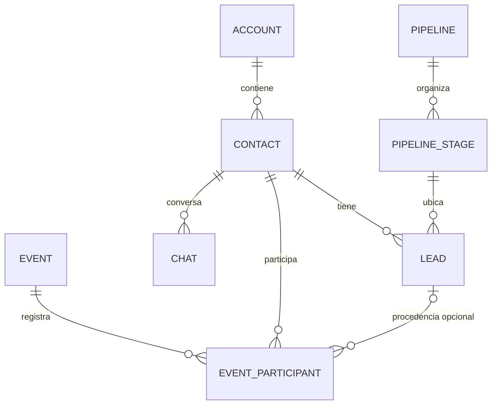
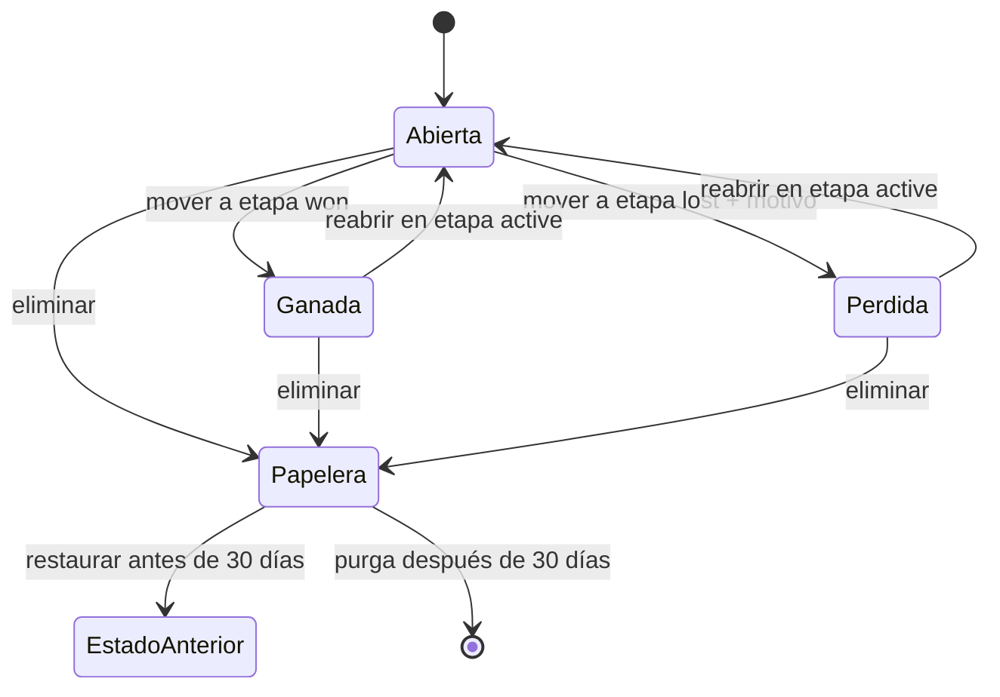

# Modelo CRM de Clarin: contactos, oportunidades, eventos y pipelines

## 1. Decisión funcional

Clarin debe distinguir cuatro conceptos que tienen ciclos de vida diferentes:

| Concepto | Qué representa | Puede repetirse | Cuándo termina |
| --- | --- | --- | --- |
| Contacto | Una persona y sus datos de identidad/comunicación | No debería duplicarse dentro de una cuenta | Solo cuando se elimina expresamente el contacto |
| Oportunidad (`Lead`) | Un interés comercial concreto del contacto | Sí: un contacto puede tener varias oportunidades | Al pasar a Ganado o Perdido; también puede reabrirse |
| Participación en evento | La pertenencia histórica de un contacto a un evento | Una vez por contacto y evento | No depende de la oportunidad comercial |
| Chat | La conversación de un contacto por un canal/dispositivo | Puede haber varios | No depende de la oportunidad ni del evento |

La regla principal es: **`Contact` es la entidad padre; `Lead` y `Chat` son hijos paralelos; `EventParticipant` referencia al contacto**. Un lead no es la persona y un evento no debe perder participantes porque una oportunidad se cierre, archive o elimine.



## 2. Invariantes de dominio

Estas reglas deben mantenerse en frontend, API, repositorios, automatizaciones, importaciones y migraciones:

1. Toda lectura y escritura está limitada por `account_id`. Un ID válido de otra cuenta se trata como inexistente.
2. Todo lead nuevo tiene `contact_id`; el contacto pertenece a la misma cuenta y no es un grupo.
3. Los datos personales —nombre, teléfono, email, DNI, dirección, fecha de nacimiento y preferencia de contacto— pertenecen a `contacts`.
4. Los datos comerciales —título, pipeline, etapa, estado, motivo de pérdida, notas de oportunidad y responsable— pertenecen a `leads`.
5. Un contacto puede tener varias oportunidades. Si ya existe una oportunidad abierta con el mismo título normalizado, se advierte al usuario, pero este puede confirmar la creación.
6. Toda oportunidad tiene estado `open`, `won` o `lost`. En pipelines configurados, el estado se deriva de `pipeline_stages.stage_type` y no se modifica directamente. Cierres históricos/importados sin pipeline pueden conservar won/lost sin etapa como excepción visible “sin asignar” hasta su revisión.
7. Cada pipeline configurado tiene una o más etapas `active`, exactamente una `won` y exactamente una `lost`, en ese orden lógico.
8. Pasar a `lost` exige un motivo. Pasar a una etapa activa reabre la oportunidad y limpia los datos de cierre.
9. Eliminar una oportunidad es un borrado lógico con papelera durante 30 días. No elimina el contacto, chat, interacciones enlazables ni participaciones en eventos.
10. `contacts.do_not_contact` es una preferencia ortogonal al estado comercial. Una oportunidad puede ser ganada y, a la vez, su contacto no contactable.
11. “No contactar” debe revalidarse inmediatamente antes de cualquier envío, incluyendo mensajes manuales, campañas, automatizaciones y demás rutas de WhatsApp.
12. La sincronización de etiquetas de eventos es aditiva: puede incorporar contactos, pero quitar una etiqueta nunca elimina un participante ya registrado.
13. Kommo API permanece inactivo. La compatibilidad local de importación se conserva, pero este cambio no habilita pollers, webhooks ni sincronización remota.
14. Una campaña construida desde oportunidades deduplica por contacto y canal: varias oportunidades coincidentes de la misma persona producen un solo destinatario.
15. La supresión de mensajería se conserva también por identidad normalizada (`jid` y teléfono). Borrar el `Contact` no vuelve elegible una identidad que estaba bloqueada.

La tabla `contact_suppressions` es el registro durable de esa decisión. Desbloquear expresamente al contacto desactiva sus supresiones; la eliminación destructiva no las elimina. La última validación ocurre dentro de `DevicePool`, de forma que handlers, campañas, automatizaciones y dinámicas comparten el mismo cierre fail-closed.

## 3. Ciclo de vida de una oportunidad



`archived` se conserva como organización operativa, pero no sustituye a Ganado/Perdido. `do_not_contact` tampoco es una etapa ni un resultado comercial.

## 4. Eventos

La pantalla de eventos trabaja con contactos:

- Agregar un participante selecciona o crea un `Contact` y después crea `EventParticipant`.
- `lead_id` es opcional y solo conserva la procedencia histórica/comercial cuando existe.
- Las etapas del evento son independientes de las etapas comerciales.
- Editar datos personales desde el participante actualiza el contacto común.
- Archivar, cerrar, enviar a papelera o purgar una oportunidad no remueve al participante.
- La fórmula de etiquetas evalúa contactos y solo agrega nuevas coincidencias.
- “No contactar” impide mensajería, pero no oculta ni elimina a la persona del evento.
- Si el contacto padre fue eliminado y la participación quedó como snapshot histórico, no puede usarse como destinatario hasta volver a vincular un contacto vivo de la misma cuenta.
- El backfill que convierte participantes históricos en contactos se ejecuta una sola vez mediante `app_data_migrations`; un reinicio posterior nunca “resucita” una desvinculación deliberada.

## 5. Pipelines y plantillas

Un pipeline puede crearse de dos formas:

- Con una plantilla sugerida: Simple, Ventas estándar o Inscripciones y servicios.
- Manualmente, empezando con una etapa activa y los resultados protegidos Ganado/Perdido.

La plantilla es un punto de partida. El usuario puede personalizar nombres, colores y orden antes de crear el pipeline; el arreglo `stages` enviado por el frontend es el diseño final y prevalece sobre `template_id`.

### Gestor de etapas

“Gestionar Etapas” edita un borrador local y guarda el layout completo de forma atómica. Requisitos:

- diálogo modal adaptable a pantalla completa, con encabezado y acciones siempre visibles;
- foco contenido dentro del diálogo, cierre con Escape y restauración del foco al control de origen;
- reordenamiento por arrastre, teclado y botones Subir/Bajar;
- objetivos táctiles de al menos 44 px;
- anuncio accesible del cambio de posición;
- validación visible de nombres vacíos o repetidos;
- Ganado y Perdido identificados también por texto/icono, no solo por color;
- confirmación antes de descartar cambios;
- al eliminar una etapa con oportunidades visibles, elección obligatoria de una etapa activa de destino;
- guardado único y transaccional, sin estados parciales.

## 6. Contratos HTTP principales

### Pipelines

- `GET /api/pipeline-templates`: catálogo inmutable de plantillas.
- `POST /api/pipelines`: crea pipeline y etapas atómicamente; acepta `template_id` y/o `stages`.
- `PUT /api/pipelines/:id/stages/layout`: guarda altas, ediciones, orden, eliminaciones y reasignaciones en una transacción.

La escritura del layout incluye:

```json
{
  "stages": [
    { "id": "uuid-existente", "name": "Contactado", "color": "#0284c7", "stage_type": "active", "position": 0 },
    { "client_id": "uuid-local", "name": "Propuesta", "color": "#ca8a04", "stage_type": "active", "position": 1 },
    { "id": "uuid-ganado", "name": "Ganado", "color": "#16a34a", "stage_type": "won", "position": 2 },
    { "id": "uuid-perdido", "name": "Perdido", "color": "#dc2626", "stage_type": "lost", "position": 3 }
  ],
  "deleted_stages": [
    { "id": "uuid-eliminado", "reassign_to_stage_id": "uuid-destino" }
  ]
}
```

### Oportunidades

- `POST /api/leads`: crea o reutiliza el contacto y crea la oportunidad.
- `POST /api/leads/from-contacts`: creación masiva con prevalidación de duplicados antes de escribir.
- `PATCH /api/leads/:id/stage`: único contrato para cerrar, reabrir o mover de pipeline.
- `DELETE /api/leads/:id`: envía a papelera.
- `PATCH /api/leads/:id/restore`: restaura.
- `DELETE /api/leads/:id/purge`: purga explícita desde papelera.
- `PATCH /api/contacts/:id/do-not-contact`: cambia la preferencia del contacto.

Las campañas solo admiten destinatarios con `contact_id` vivo de la misma cuenta. Un destinatario que pierde el contacto o queda DNC después de encolarse pasa a `skipped` (“Omitido por privacidad”), no a `failed`, y no puede reintentarse.

Un posible duplicado responde `409` con `code: "possible_duplicate"`. El frontend muestra contexto y puede repetir la solicitud con `confirm_duplicate: true`.

## 7. Migración de datos

La migración de arranque debe ser idempotente y ejecutarse desde `Migrate()`:

1. Agregar campos de título, cierre y papelera al lead.
2. Agregar preferencia “no contactar” al contacto y supresión durable por JID/teléfono.
3. Clasificar etapas terminales con reglas conservadoras: IDs Kommo 142/143 y nombres exactos conocidos.
4. Crear Ganado/Perdido solo en pipelines que ya tienen etapas; mantener vacío un pipeline aún no configurado para que la UI ofrezca plantilla/manual.
5. Normalizar posiciones y nombres repetidos antes de crear restricciones únicas.
6. Derivar `leads.status` desde `stage_type`.
7. Traducir bloqueos históricos: resultados comerciales inequívocos a won/lost; todo bloqueo residual se conserva de forma fail-safe en `contacts.do_not_contact`. Los motivos no reconocidos quedan pendientes de revisión para evitar reactivar contactos accidentalmente.
8. Completar una sola vez `event_participants.contact_id` por lead, coincidencia inequívoca de teléfono/email o contacto sintético aislado en la misma cuenta; registrar el marcador antes de futuros reinicios.
9. No copiar notas personales y comerciales entre entidades durante el backfill.
10. Crear índices para lifecycle, papelera, duplicados, etapas y participantes por contacto.

La migración nunca debe inferir como ganado términos ambiguos como “Confirmado” o “Inscrito” en pipelines históricos; una clasificación incorrecta altera métricas y requiere decisión humana.

## 8. Criterios de aceptación

### Funcionales

- Un contacto conserva chat, etiquetas y eventos al eliminar cualquiera de sus oportunidades.
- Un contacto puede tener dos oportunidades con títulos distintos y puede confirmar dos abiertas con el mismo título tras la advertencia.
- Mover a Perdido sin motivo falla sin modificar la oportunidad.
- Reabrir limpia `closed_at`, `closed_by` y `close_reason`.
- Ganado/Perdido aparecen en métricas aunque el contacto esté marcado “no contactar”.
- Un participante histórico sin lead continúa visible y editable.
- Quitar una etiqueta del contacto no lo expulsa de eventos anteriores.
- Ninguna operación masiva acepta IDs de participantes, contactos, etapas o eventos de otra cuenta.
- Ninguna vía de WhatsApp envía a un contacto “no contactar”, incluso si fue bloqueado después de crear una campaña.
- Una campaña desde tres oportunidades de un mismo contacto crea un destinatario único y reporta por separado oportunidades coincidentes y contactos elegibles.

### Técnicos

- Las operaciones de layout y los cambios de etapa son transaccionales.
- Las consultas paginadas y conteos aplican los mismos filtros de lifecycle.
- Los endpoints devuelven `404` para recursos ajenos y `422` para transiciones/layouts inválidos.
- Las restricciones de base de datos impiden status y tipos de etapa inválidos, posiciones duplicadas y más de una etapa won/lost por pipeline.
- El frontend ignora respuestas asíncronas obsoletas y no sobrescribe filtros o selecciones recientes.
- Los diálogos críticos son utilizables con teclado, lector de pantalla, móvil y zoom/reflow.

## 9. Verificación antes de desplegar

1. `GOCACHE=/tmp/go-build go test ./...` y compilación del servidor desde `backend`.
2. `npx tsc --noEmit --incremental false` y `npm run build` desde `frontend`.
3. Ejecutar la migración dos veces contra una base temporal: una vacía y otra con datos históricos conflictivos.
4. Probar manualmente creación simple/manual, edición y reordenamiento de etapas con mouse y teclado.
5. Probar duplicado advertido/confirmado, ganado, perdido con motivo, reapertura, papelera y restauración.
6. Probar evento con contacto sin lead, con varios leads y con lead eliminado.
7. Probar aislamiento con IDs válidos de dos cuentas distintas.
8. Probar “no contactar” después de encolar una campaña y antes de su envío efectivo.

El despliegue se realiza únicamente después de estas verificaciones y de una solicitud explícita para publicar los cambios.
